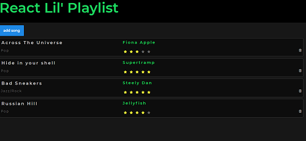

# Lil' Playlist React App with Api endpoint

## Requirements:

Om aan de eisen van de (denkbeeldige) werkgever te moeten voldoen verwachten we dat jullie SPA aan de volgende **core functionaliteiten** voldoet:

- Als gebruiker wil ik de volgende gegevens over mijn nummer willen invullen: titel, artiest, genre, rating (dropdown menu is geen vereiste).
- Als gebruiker wil ik op één button kunnen klikken waardoor mijn ingevulde nummer toegevoegd wordt aan mijn playlist.
- Als gebruiker wil ik mijn nummers kunnen zien in een overzicht (mijn playlist), waar alle ingevulde gegevens in zichtbaar zijn.

## ✅ Geslaagd = Core Functionaliteiten + 3 punten

Naast deze bovenstaande Core Functionaliteiten zijn jullie verplicht om 3 extra punten uit de onderstaande lijst te kiezen.

**Aanvullende punten:**

- **1 PUNT** – **Delete knop**: verwijderen van liedjes uit de state (super bonus punten als deze dan ook nog verwijderd worden uit de database)
- **2 PUNTEN** – **REDUX**
- **3 PUNTEN** – **Firebase API:** Toevoegen van een end-point in de database om, de data op te slaan

## Design 🖌️
Deze week ligt de focus 100% op React. Binnen React komt alle "logica" en functionaliteit uit het gebruik van JavaScript met praktijkvoorbeelden. CSS moet het **laatste** zijn waar je mee aan de slag gaat.
